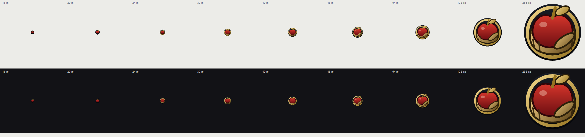

# Бета

**Бета** — настольный архиватор для Windows с собственным расширением `.b3ta`. Версия 0.1.0.

Программа собирается в один файл `Бета.exe`: обычное окно с перетаскиванием файлов, кнопками
«Упаковать», «Распаковать», «Что внутри», уровнем сжатия и журналом операций.

Главная особенность — совместимость. Внутри `.b3ta` лежит не «свой» закрытый формат, а обычный
архив 7z, поэтому файл открывают 7-Zip, WinRAR и любой другой распаковщик без плагинов и без
установки самой программы. «Бета» при этом добавляет своё расширение, своё окно, выбор уровня
сжатия и понятные сообщения об ошибках.

> **Коротко:** свой формат — без блокировки. Своё расширение — с полной совместимостью.


## Возможности

- Перетаскивание файлов и папок в окно: обычные файлы и папки упаковываются, архив — распаковывается.
- Кнопки «Упаковать в .b3ta», «Распаковать», «Что внутри» (список записей с размерами), «Отмена».
- Уровень сжатия от 0 (без сжатия, быстро) до 9 (максимум, медленно), по умолчанию 5.
- Галочка «После распаковки открыть папку».
- Журнал с временем каждой строки, прогресс-бар, понятные сообщения об ошибках.
- Меню «Архив» (привязка/отвязка расширения, выход), «Вид» (очистить журнал), «Справка».
- Консольный режим для скриптов и автоматизации.
- Никаких сторонних библиотек: свой код сжатия не пишется, используется установленный `7z.exe`.

## Совместимость

`.b3ta` — это 7z. 7-Zip и WinRAR определяют тип файла по **первым байтам** (сигнатуре), а не по
расширению. В начале `.b3ta` лежит сигнатура `37 7A BC AF 27 1C` — ровно та же, что у обычного
`.7z`. Файл «весит» как 7z и потому читается как 7z.

Это не теория: самопроверка делает копию `.b3ta`, переименовывает её в `.xyz` — и такой файл
по-прежнему читается и распаковывается.

| Способ открыть `.b3ta` | Подробности |
| --- | --- |
| 7-Zip | Меню → «Открыть архив…», или просто двойной клик, если 7-Zip выбран для `.7z` |
| WinRAR | То же самое, WinRAR тоже узнаёт 7z по сигнатуре |
| «Бета» | Двойной клик после привязки расширения (меню «Архив») |
| «Открыть с помощью» | Выбрать 7-Zip или WinRAR вручную, без всяких настроек |
| Перетаскивание | Бросить файл на окно 7-Zip или на иконку WinRAR |
| Переименование | `.b3ta` → `.7z`, и всё открывается как обычно |

## Системные требования

| | |
| --- | --- |
| ОС | Windows 10 1809 или новее (x64) |
| Среда выполнения | .NET 8 Desktop Runtime — для обычной сборки (~0,37 МБ) |
| Спин-офф | `-SelfContained`: .NET не нужен, файл ~150 МБ |
| 7-Zip | Требуется установленный 7-Zip (движок вызывается как подпроцесс) |

## Загрузка

Готовые сборки — на странице [Releases](https://github.com/ABABA676/beta-archiver/releases):

| Файл | Размер | Когда нужен |
| --- | --- | --- |
| [`Beta-win-x64.exe`](releases/latest/download/Beta-win-x64.exe) | ~0,37 МБ | .NET 8 Desktop Runtime уже установлен |
| `Beta-win-x64-selfcontained.exe` | ~150 МБ | Нет .NET — работает на любом компьютере |

## Установка

1. Скачайте `Beta-win-x64.exe` (или self-contained версию, если нет .NET) — это один файл.
2. Запустите его — установка не требуется.
3. Чтобы Windows открывала `.b3ta` двойным кликом в «Бете», выполните «Архив → Привязать
   расширение .b3ta…». Отменить — «Архив → Убрать привязку .b3ta».

> 7-Zip должен быть установлен — программа использует его движок сжатия.

## Сборка из исходников

Нужны **.NET 8 SDK** и установленный **7-Zip**.

```powershell
.\build.ps1                 # один .exe ~0,37 МБ, требуется .NET 8 Desktop Runtime
.\build.ps1 -SelfContained  # один файл ~150 МБ, работает везде без установки .NET
.\build.ps1 -NoUiTest       # только проверки движка, без проверки окна (быстрее)
```

Результат — `Билд\Бета.exe`. Сборка сразу прогоняет самопроверку и **падает с ошибкой, если
хотя бы одна проверка не прошла**.

## Использование

1. Запустите `Бета.exe`.
2. Перетащите в окно файлы или папки — они упакуются в `.b3ta` рядом с ними.
3. Перетащите архив `.b3ta` — он распакуется в отдельную папку с тем же именем.
4. Нужно посмотреть содержимое, не распаковывая, — нажмите «Что внутри».
5. Уровень сжатия выбирается до упаковки, ход операции виден в журнале и прогресс-баре.
6. Если запустить `Бета.exe` с путём к файлу (в том числе двойным кликом по архиву после
   привязки расширения), программа сразу упакует обычный файл или распакует архив.

### Консольный режим

```
Бета.exe --pack <архив.b3ta> <файл|папка…>   упаковать (обычный 7z внутри)
Бета.exe --extract <архив.b3ta> <папку>      распаковать
Бета.exe --list <архив.b3ta>                 что внутри
Бета.exe --test <архив.b3ta>                 проверить целостность
Бета.exe --selftest                          полная самопроверка
Бета.exe --uitest                            проверка, что окно создаётся
Бета.exe --pack -mx=9 <архив.b3ta> <файл>    задать уровень сжатия
Бета.exe -h | /?                             справка
```

Флаг `-mx=N` допустим в любой позиции после `--pack`.

## Устройство проекта

Стек: **C# / .NET 8 / WinForms**, `PublishSingleFile`, ноль сторонних библиотек и пакетов NuGet.
Движок сжатия — установленный `7z.exe` из 7-Zip (`C:\Program Files\7-Zip\7z.exe`), ищется также в
`%ProgramFiles(x86)%` и `%LOCALAPPDATA%\Programs\7-Zip`.

| Файл | Назначение |
| --- | --- |
| `Код/Бета.csproj` | Проект: `net8.0-windows`, WinForms, `WinExe`, версия 0.1.0, без пакетов NuGet |
| `Код/Program.cs` | Точка входа: без аргументов — окно, с ключом `--команда` — консольный режим (`AllocConsole`), вывод в UTF-8 |
| `Код/Engine.cs` | Работа с движком: поиск `7z.exe`, запуск с прогрессом/логом/отменой и таймаутом 30 минут, `Pack`, `Extract`, `List`, `Test`, проверка сигнатуры 7z, общий корень для путей внутри архива |
| `Код/Cli.cs` | Команды `--pack/--extract/--list/--test/--selftest/--uitest` и самопроверка из 25 проверок с подсчётом SHA-256 |
| `Код/MainForm.cs` | Главное окно, собранное кодом: drag&drop, кнопки, уровень сжатия, журнал, прогресс, меню, справка |
| `Код/Association.cs` | Привязка `.b3ta` в реестре профиля (`HKCU\Software\Classes`), ProgId `Beta.b3ta.Archive`, пункт «Открыть с помощью» для 7-Zip и WinRAR |
| `build.ps1` | Публикация одним файлом в `Билд\` и прогон самопроверки |
| `Тесты.ps1` | Собирает, если `.exe` ещё нет, и прогоняет самопроверку |
| `Ресурсы/make_icon.ps1` | Генератор иконки: векторная отрисовка и сборка многослойного `.ico` |

## Тесты

```powershell
.\Тесты.ps1                # или Билд\Бета.exe --selftest
.\Тесты.ps1 -SelfContained # то же самое на «толстой» сборке
```

Самопроверка подставляет настоящие данные (кириллица в именах, текст 5000 символов, двоичный
файл 2 МБ) в `%TEMP%` и проверяет 25 пунктов:

- архив создаётся, а внутри — настоящий 7z по сигнатуре;
- список читается, размер совпадает с исходником, структура папок сохранена;
- распаковка проходит, **SHA-256 и посимвольный текст совпадают** — это и есть «без потери качества»;
- двоичный файл 2 МБ совпадает побайтно, `7z t` считает архив целым;
- файл с чужим расширением (`.xyz`) читается и распаковывается;
- уровни 0 и 9 реально различаются, прогресс реально приходит;
- мусорный файл даёт понятное сообщение, а не молчание;
- отмена отрабатывает, процессов `7z` не остаётся.

Текущий результат: **25 OK / 0 FAIL**.

## Привязка расширения

Меню «Архив → Привязать расширение .b3ta…» пишет в `HKCU\Software\Classes` — только в профиль
текущего пользователя, **права администратора не нужны**. Создаётся ProgId `Beta.b3ta.Archive` с
описанием, иконкой и командой открытия; в `OpenWithProgids` добавляются настоящие ProgID тех
программ, которые реально стоят в системе (у 7-Zip это `7-Zip.7z`, а не `7-Zip` — имена ProgID
на разных машинах разные, поэтому берутся из реестра в момент привязки, а отсутствующие
пропускаются). Если ранее для `.b3ta` была выбрана другая программа с галочкой «Всегда», «Бета»
предложит сбросить этот выбор. После привязки Проводник уведомляется (`SHChangeNotify`), чтобы
сразу подхватить иконку и меню. Чужие расширения (`.7z`, `.zip`) не затрагиваются.
Отменить — «Архив → Убрать привязку .b3ta».

## Иконка



«Яблоко раздора»: тёмный медальон, бронзовая рука, багровое яблоко и золото. Иконка нарисована не
вручную, а генерируется кодом — `Ресурсы/make_icon.ps1` рисует её векторно и собирает
многослойный `.ico` на 9 размеров (16…256 px), с тремя уровнями детализации: на мелких размерах
ладонь и палец убраны, иначе силуэт превращается в бурую кляксу.

Иконка вшита в `Бета.exe` (`ApplicationIcon`), поэтому и файлы `.b3ta` после привязки расширения
получают её автоматически.

## Ограничения

- Для незнакомого расширения **не появляются** пункты «Извлечь сюда» и «7-Zip → Открыть архив»
  в контекстном меню Проводника. Обходные пути: «Открыть с помощью», перетащить файл на окно
  7-Zip или иконку WinRAR, переименовать `.b3ta` в `.7z`.
- Нет превью архива в Проводнике (не реализован `IPreviewHandler`).
- Нет установщика и программы удаления.
- Распаковка кладётся в отдельную папку рядом с архивом; при повторе к имени добавляется « (2)».
- Нет встроенного движка `7z.dll` — 7-Zip должен быть установлен.
- Тёмная тема не поддерживается.

## Планы

- Встроенный движок (`7z.dll`), чтобы программа работала без установленного 7-Zip.
- Превью архива в Проводнике — `IPreviewHandler`.
- Установщик и программа удаления.
- Своё распаковывание сразу на месте (без отдельной папки).
- Тёмная тема.

## Contributing

Приветствуются issue и pull request. Перед отправкой убедитесь, что самопроверка зелёная:

```powershell
.\build.ps1        # сборка сама прогоняет 25 проверок и падает при любой ошибке
```

Стиль кода — как в существующих файлах: явные имена, никаких «магических» значений, обработка
ошибок с понятным человеку текстом. К крупным изменениям прикладывайте запись в `CHANGELOG.md`.

## Лицензия

[MIT](LICENSE) — можно использовать, изменять и распространять, в том числе в коммерческих
программах.

Своего кода сжатия проект не содержит: вместо линковки чужих библиотек вызывается отдельная
программа `7z.exe` как подпроцесс — то есть чужая библиотека не включается в сборку и не требует
лицензирования исходников «Беты».

Сам **7-Zip** — отдельный проект Игоря Павлова со своей лицензией (LGPL с дополнительным
ограничением unRAR). Он в этот репозиторий не входит и должен быть установлен отдельно; его
условия распространяются на него самого.
